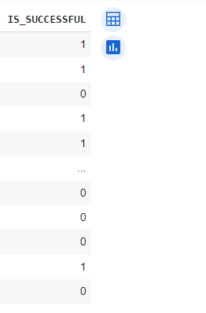
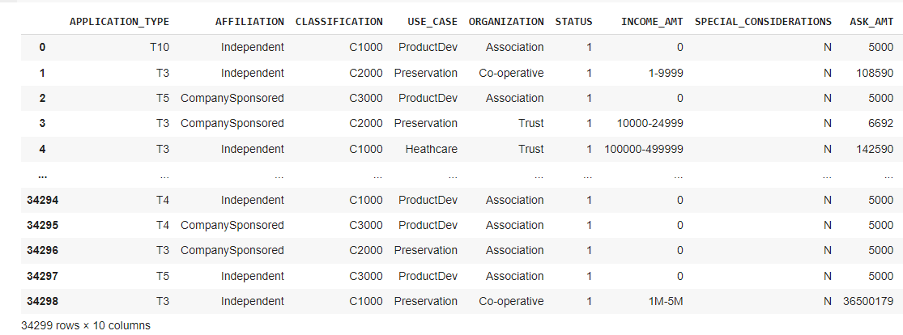
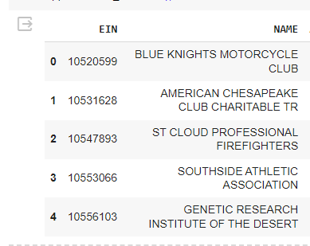
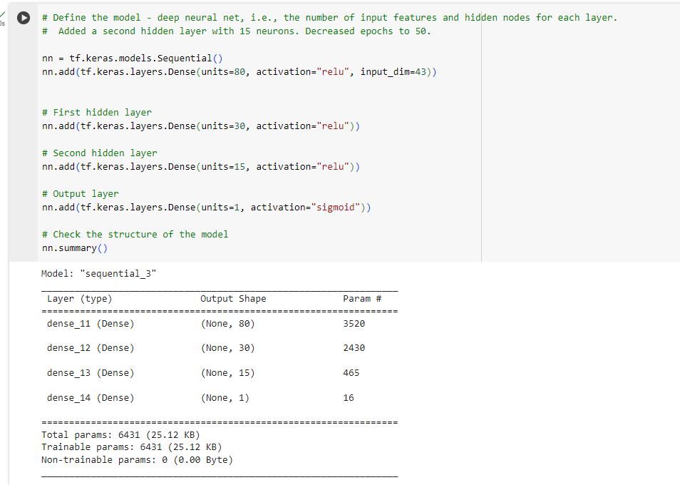
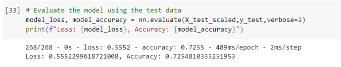

# Deep Learning Funding Decisions

# Project Summary

This project involves using machine learning and neural networks to create a binary classifier for Alphabet Soup's funding applicants. The dataset contains metadata about organizations, and the goal is to predict their success if funded. Steps include preprocessing the data, compiling, training, and evaluating the neural network model, optimizing the model for higher accuracy, and writing a report on the model's performance.
Starter_Code folder contains my completed code files from Google Colab. 

# Overview:

The purpose of this analysis is to use a machine learning model to analyze the Alphabet Soup's funding data in order to develop an app that can automatically select the best applicants for Alphabet Soup to fund.  

# Results: 

The following variable is the Target of the model:
- Is_Successful

The following variables are the features of the model:
- Application Type
- Affiliation
- Classification
- Use_Case
- Organization
- Status
- Income_amt
- Special Considerations
- Ask_Amt

The following variables were removed from the input data:
- EIN
- NAME

Compiling, Training, and Evaluating the Model

- Number of Neurons: 80 in the first layer, 30 in the first hidden layer, 15 in the second hidden layer, and 1 in the last layer. 

- Layers: 2 hidden layers in addition to the first layer and the output layer. 

- Activation Functions: relu and sigmoid. 

I  also used 50 epochs. 

# Why were these used?

These parameters were selected because increasing the number of neurons can help to increase the performance of the model. In addition, adding layers (up to 2) may also help to get a better performance. I kept the relu and sigmoid activation functions because other functions such as tanh decreased the performance of the model. 

See the image below for the image of the best performing parameters:

# Was target model performance achieved?

I was not able to hit 75% for the accuracy. The highest performance achieved was .7255 or 72.55% for accuracy. 

# Steps taken to increase model performance:

Attempt 1: I added a second hidden layer with 15 neurons and a relu activation, and decreased the epochs to 50. 

Attempt 2: I increased the epochs to 100, removed the second hidden layer, and increased the neurons to 40 in the first hidden layer with a relu activation.  

Attempt 3: I increased the first hidden layer neurons to 60 with an activation of relu. I added a second hidden layer with 60 neurons and an activation function of tanh. 

# Summary of Results:

In terms of model optimization attempts, the first iteration proved to be the most effective among the three. To further bolster performance or explore alternative models, I would consider adjusting or removing different data columns and potentially shifting focus to a different target variable, such as STATUS. This adjustment could potentially yield performance improvements. Additionally, insights gleaned from the new target variable could inform decisions regarding funding for the company, particularly with regard to loan considerations. Despite adjustments made to layers, neurons, and activation functions, significant performance enhancements were not achieved, prompting a reconsideration of the original dataset.
